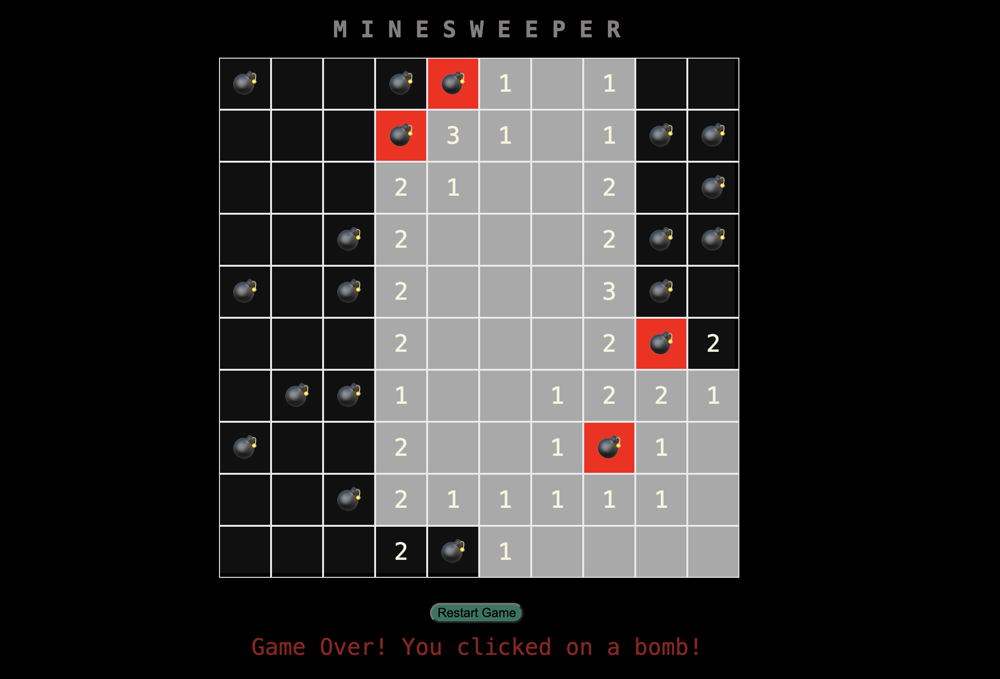

#  💣 MINESWEEPER  🔢

#### Minesweeper is a vintage puzzle game originally created in 1989 and published by Microsoft Corporation.  It's a logic based game that allows the user to reveal cells on the grid that hides numbers and bombs/mines that are randomized on the board.  

## Technologies Used
*HTML  
*CSS  
*Javascript  
*Emojipedia.org

## Play MINESWEEPER Here!  ⬇️

https://spiritb90.github.io/Minesweeper-Game/ 

## Future Enhancements

*Add a win feature for the user  
*Add a media query to adjust for smaller screens